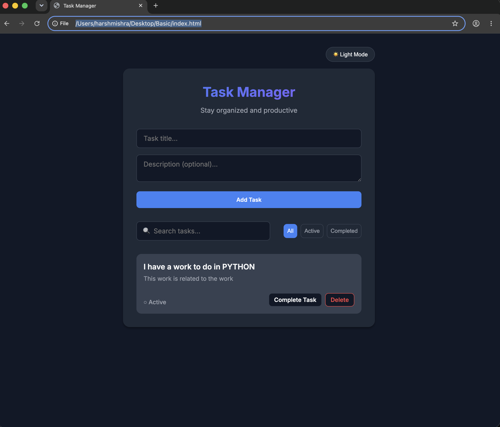

# Vanilla JavaScript Task Manager

A feature-rich, modern Task Manager application built entirely with HTML, CSS, and Vanilla JavaScript. This project showcases fundamental and advanced web development concepts, demonstrating a strong understanding of front-end technologies without the reliance on external libraries or frameworks.

## 🚀 Features

- **Task Management**: Add, complete, and delete tasks.
- **Search & Filter**: Instantly search tasks by title/description and filter by Active/Completed status.
- **Data Persistence**: Tasks and theme preferences are saved to `localStorage`, ensuring data remains after page reloads.
- **Dark/Light Theme**: Built-in support for dark mode with CSS variables and theme toggling.
- **Responsive Design**: Fully responsive UI that adapts to mobile and desktop screens.
- **Animations & Transitions**: Smooth micro-animations for adding tasks and interacting with buttons.
- **Security**: Includes basic XSS prevention by escaping HTML input before rendering.

## 🛠️ Technical Highlights

### HTML5
- **Semantic Markup**: Proper use of `<header>`, `<section>`, and forms for better accessibility and SEO.
- **Form Validation**: Input groups with integrated error messaging and attributes like `maxlength` and `autocomplete="off"`.
- **Accessibility**: ARIA labels (e.g., `aria-label="Toggle dark mode"`) and semantic structure.

### CSS3
- **CSS Variables (Custom Properties)**: Extensive use of CSS variables for theming and maintaining a consistent color palette across light and dark modes.
- **Flexbox Layouts**: Advanced use of Flexbox for aligning components, creating responsive task cards, and structuring the header/controls.
- **Micro-Animations**: Keyframe animations (`@keyframes slideIn`) for smooth element rendering and hover state transitions.
- **Responsive Design**: Media queries (`@media (min-width: 640px)`) to adjust layouts for different screen sizes.

### JavaScript (ES6+)
- **DOM Manipulation**: Dynamic creation and rendering of HTML elements using `document.createElement` and `innerHTML`.
- **Event Handling**: Efficient use of `addEventListener` for forms, inputs, and buttons.
- **State Management**: Managing application state (`tasks`, `currentFilter`, `searchQuery`) purely in Vanilla JS.
- **Data Persistence**: Utilizing the Web Storage API (`localStorage`) with JSON parsing/stringifying.
- **Array Methods**: Heavy utilization of `map`, `filter`, and `forEach` for filtering and rendering tasks.
- **Security**: Implementation of a custom `escapeHTML` function to prevent Cross-Site Scripting (XSS) attacks.

## 📁 Project Structure

- `index.html` - The structural skeleton of the application.
- `style.css` - All styling, theming, and responsive design rules.
- `script.js` - Application logic, state management, and DOM manipulation.

## 🚦 How to Run

1. Clone or download this repository.
2. Open `index.html` in any modern web browser.
3. No build tools or `npm install` required!

